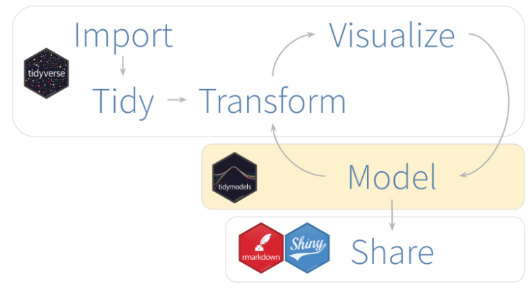
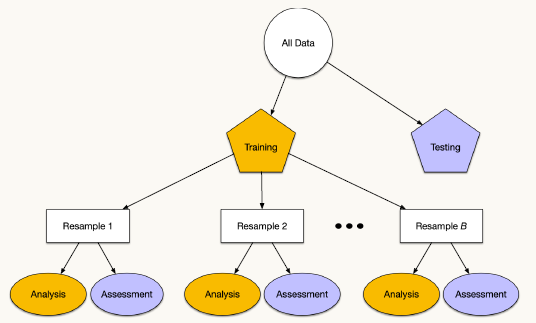
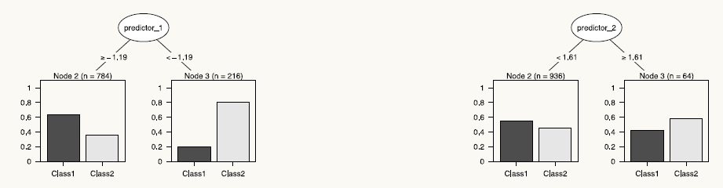
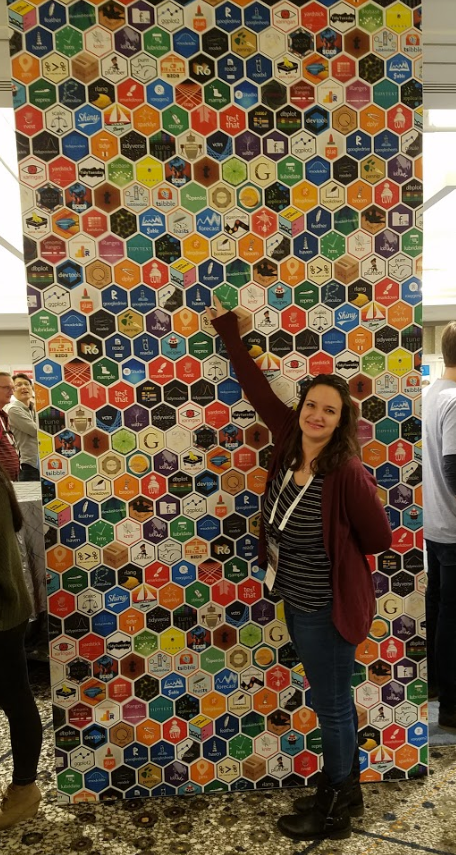
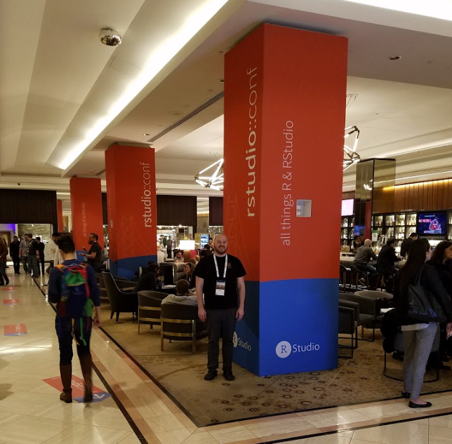
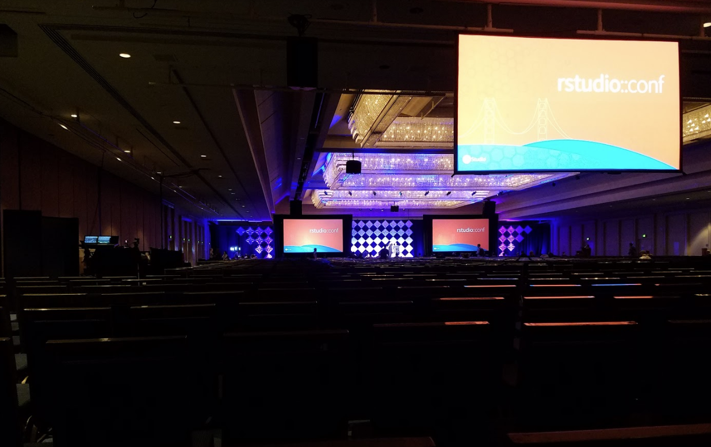

## Things I Learned @ rconf::2020

San Francisco has a homeless problem.  Ask Marianne about it.  

--

Hex stickers are totally a thing.  Look at Nick's laptop.  

--

The first two days I attended the applied machine learning workshop.  Course material for all workshops is available here:
<https://github.com/rstudio-conf-2020>.

--

The last two days consistented of four concurrent lecture tracks.  It was hectic swapping rooms with 2,500 people every few minutes.  I'll share some of the highlights.    

---

## Why Use R for Predictive Modeling?

<br>
<br>
* R has cutting edge model capabilities

<br>
<br>

* R allows you to easily incorporate the best of the other languages
--You can access tensorflow, keras, python, or just about anything else without leaving the R environment

---

## Downsides to modeling in R

<br>

- R is a data analysis language, not a high performance deployment language like C.  

<br>

- R should be treated like a prototyping language.  
<br>

- Production application deployment should be done in a more appropriate language using models that were proven in R. 

---

background-image: url(images/tidymodels2.png)
background-position: 90% 5%
background-size: 8%

# Caret to Tidymodels

<br>
<br>

The modeling workshop mostly highlighted the new `tidymodels` package created by Max Kuhn.  

--
<br>

<font color="red">`tidymodels`</font> was developed as a successor to the <font color="red">`caret`</font> package which Max also wrote
<br>
*(Caret is short for **C**lassification **A**nd **RE**gression **T**raining)*


---


## <font color="red">`tidymodels`</font> Package

This is the basic workflow to create a model using the tidymodels package.  

.center[]


---

## Predictive Modeling Process:

1. Estimating model parameters (What predictors to select?)

2. Determine tuning parameters (# of trees, # of folds, etc.)

3. Model selection and model comparison (lm, MARS, randomForest)

4. Evaluating model performance (RSME, runtime)

<b>Predictive modeling should be considered a marathon, not a short sprint. </b>

---

## How do we "spend" data? 

The recommended practice for introducing data to a model is splitting


- <b>Training Set</b>: Used to estimate model parameters

- <b>Test Set</b>: Used to get an independent assessment of model efficacy.  Should not be used during model training.

.center[]


---

## Ways to Split Data:

- Random Sampling

- Stratified Sampling

- Date Based Sampling

- Sample from predictor distributions

---

## Ames Iowa Housing Data

The <font color="red">`AmesHousing`</font> package will be used to demonstrate features of the tidymodels package.  

The <font color="red">`initial_split`</font> function can be used to break data into training and test sets.  

```{r split_pre, echo= FALSE, message=FALSE, warning=FALSE}

library(tidymodels)
library(AmesHousing)
library(tune)
ames <- make_ames()
```

```{r split, echo= TRUE, message=FALSE, warning=FALSE}

nrow(ames)

(data_split <- initial_split(ames))  #<<

ames_train <- training(data_split)
ames_test <- testing(data_split)
                  
nrow(ames_train)/nrow(ames)
#nrow(ames_test)/nrow(ames)

```

---

## Linear Regression Model in R

Who has run a linear regression in R?  How did you do it?

--

```{r split2, echo= TRUE, message=FALSE, warning=FALSE}

simple_lm <- lm(Sale_Price ~ Longitude + Latitude, data = ames_train) #<<
summary(simple_lm)

```


---

## Model Function Differences

`lm()` is not the only way to perform a linear regression in R

- <font color="red">`glmnet`</font> is used for regularized regression

- <font color="red">`stan`</font> is used for Bayesian regression

- <font color="red">`keras`</font> is for regression using tensorflow

- <font color="red">`spark`</font> is often used for large data sets

Each function has it's own syntax that is difficult to remember which makes it difficult to do quick comparisons between models.  


---

background-image: url(images/parsnip.png)
background-position: 90% 5%
background-size: 8%

## Parsnip to the Rescure

<font color="red">`parsnip`</font> put a wrapper around all the modeling functions to standarize the syntax

<br>
<br>

To specify a model with parsnip:

- Pick a `model`
<br>
<br>
- Set the `engine`
<br>
<br>
- Set the `mode`

---

## Pick a Model

Models that work with parsnip can be found here:
<https://tidymodels.github.io/parsnip/articles/articles/Models.html> 

```{r parsnip}
lm_spec <- linear_reg() %>%               # Pick a model  
           set_engine(engine = "lm") %>%  # set engine
           set_mode(mode = "regression")  # set mode

# Train the model by using the fit function
(lm_fit <- fit(lm_spec, log10(Sale_Price) ~ Longitude + Latitude, data = ames_train))

```

---

## Prediction

Typically you should not jump to predicting your test set at this point.  You should use resampling methods (e.g. cross-validation) to evaluate the model.  But for now we will jump to prediction to show how the code works.


```{r predict}

price_pred <- predict(lm_fit, new_data = ames_test)  #<<
price_pred %>% slice(1:5)


```

---

## Prediction Cont.


```{r predict2}

price_pred <- price_pred %>% 
                bind_cols(ames_test) %>% 
                mutate(log_price = log10(Sale_Price)) %>% 
                dplyr::select(.pred, log_price) 
price_pred %>% slice(1:5)                

rmse(price_pred, truth = log_price, estimate = .pred)  #<<

```

---

## Classification Models

A classification tree searches through each preidctor to find a value for each variable the best splits the data into two groups.  

These are nice as they allow the use of both continuous and categorical data to fit the model.  

<br>
<br>
.center[]

---

## Classification Models

```{r randomf, echo= TRUE, message=FALSE, warning=FALSE}

library(randomForest)
{{ (rf_fit=randomForest(mpg ~ ., data=mtcars)) }}

```

---

## # of Trees

```{r randomf2, echo= TRUE, message=FALSE, warning=FALSE}

# Plot of MSE vs # of trees used to fit the model.  
plot(randomForest(mpg ~ ., mtcars, keep.forest=FALSE, ntree=100), log="y")  #<<

```

---

## Variable Importance Plot

```{r randomf3, echo= TRUE, message=FALSE, warning=FALSE}

library(vip)
vip(rf_fit)

```

---

## Other Topics Covered in Max's Workshop:

.pull-left[
- Interactions
- Zero Variance Factors
- Principle Component Analysis
- Resampling - splitting methods for training / test data sets
- V-Folds Cross Validation
- K- Nearest Neighbors
- Tuning parameters
- Recipes
]

.pull-right[
- Overfitting
- Grid Search
- Glmnet Models
- Parallel Processing
- MARS - Multivariate Adaptive Regression Splines
- Hinge Functions
- Boosting

]

---


class: inverse, middle, center

# Conference Lecture Topics


---

## Package Development

Several lectures discuss packages that were created to solve specific user issues.  My take away was that I need to learn how to create a package so that I can relate to the problems and solutions discussed.  

Hadley frequently says if you have to copy and paste more than twice, you should write a function.  A package is a great way to store all the functions that you frequently use in your job.  


Rmarkdown, Git, and Roxygen2 make creating a package fairly easy.  Hadley wrote a book that details how to use packages in R: <http://r-pkgs.had.co.nz>.


---

background-image: url(images/shiny.png)
background-position: 90% 5%
background-size: 8%


## Shiny App

<br>

Shiny is an R package that allows you to create interactive web applications.  These could be great applications for business unit metrics.  

<br>

There are lots of free resources on the web with Shiny tutorials.  
<https://bookdown.org/hadrien/how_to_build_a_shiny_app_from_scratch/>

**DEMO:** My Shiny app for NaF trends by batch code.


---

background-image: url(images/rstudio_git.png)
background-position: 90% 5%
background-size: 16%


## Git / Github

<br>
<br>

As you get serious about coding, you need to setup a github repository for storing, versioning, and sharing code.  Rstudio has some neat Github integration that makes it easy to store your projects and files in the cloud and access them anywhere.  


---

background-image: url(images/rmarkdown.png)
background-position: 90% 5%
background-size: 8%


## Rmarkdown 

<br>
<br>

Rmarkdown has many more capabilities that I realized.  **I created this slide deck in Rmarkdown.**
<br>
<br>

Marianne attended the Rmarkdown workshop, so I'll let her elaborate on some neat features of Markdown.  


---

background-image: url(images/sql.png)
background-position: 75% 80%
background-size: 28%


## SQLDF

Ian Cook gave a great talk about switching between dplyr and sql.  While there are many functions that take SQL code and put it into R, there are not many options for execting SQL commands on R objects.  

<br>

sqldf() transparently sets up a database, imports the data frames into that database, performs the SQL statement, then returns the result as a data frame to R.

---

## Computer System Validation

<br>

Ellis Hughes gave an intresting lecture on how he uses R to automate his computer system validations using rmarkdown, testthat, and roxygen2.  

<br>
<br>

Link to slides:
<https://thebioengineer.github.io/validation/>


---

## Using R to Create Reproducible Engineering Test Reports

<br>

Ana Santos presented on how she uses Rmarkdown to create process validation IOQ and PQ reports at Biosense Webster.

<br>

She didn't share the slides from this presentation though.  

---

## livecode

<br>

Colin Rundel presented on how to broadcast live coding sessions.  

<br>

Link to slides:
<http://rundel.github.io/Presentations/RStudioConf2020/RStudioConf2020.html#1>


---

background-image: url(images/cheat.png)
background-position: 50% 80%
background-size: 45%

##Cheat Sheets

RStudio has some helpful cheat sheets in case you struggle with function syntax.  


---

background-image: url(images/debug.png)
background-position: 50% 50%
background-size: contain

---

background-image: url(images/brood.png)
background-position: 50% 50%
background-size: contain

---

background-image: url(images/turnoff.png)
background-position: 50% 50%
background-size: contain

---

background-image: url(images/reprex.png)
background-position: 50% 50%
background-size: contain

---

background-image: url(images/reprex2.png)
background-position: 50% 50%
background-size: contain

---

background-image: url(images/needle.png)
background-position: 50% 50%
background-size: contain

---
background-image: url(images/reprex3.png)
background-position: 50% 50%
background-size: contain

---

class: inverse, middle, center

## The End!

<p></p>

<p></p>

<p></p>


